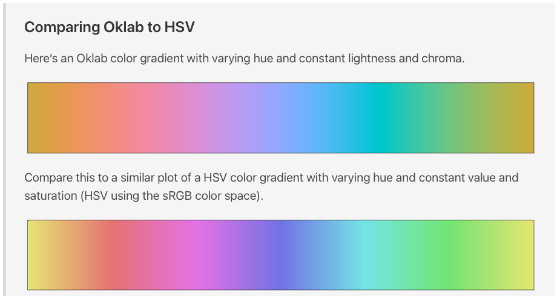

# Oklab/Oklch color space for Go

[](https://pkg.go.dev/github.com/alltom/oklab)

Oklab is a more perceptually-accurate color space than HSV. Oklch is the same space with polar coordinates.

Great compatibility with Go's image library:

* oklab.Oklab and oklab.Oklch implement image.Color
* oklab.OklabModel and oklab.OklchModel implement image.Model

See https://bottosson.github.io/posts/oklab/ for the details, but here's the tl;dr:



[This library is fully-documented, with examples](https://pkg.go.dev/github.com/alltom/oklab), but here's how to convert Oklab to RGB:

```
oklabc := oklab.Oklab{L: 0.9322421414586456, A: 0.03673270292094283, B: 0.0006123556644819055}
r, g, b, _ := oklabc.RGBA()
```
